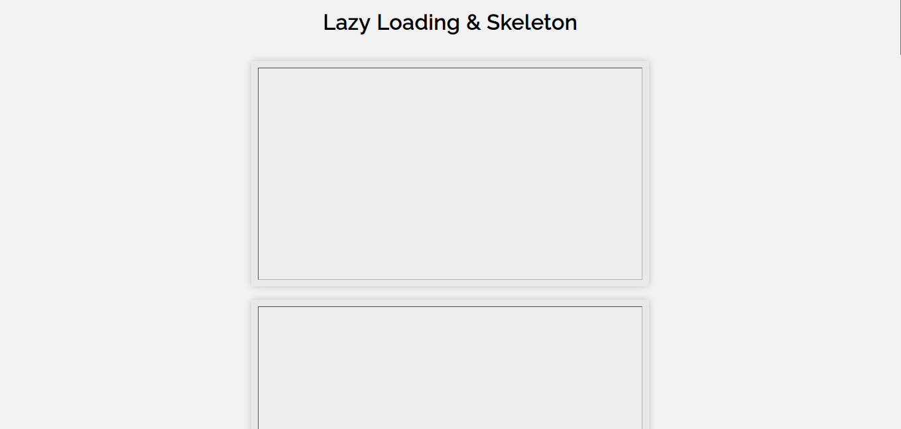
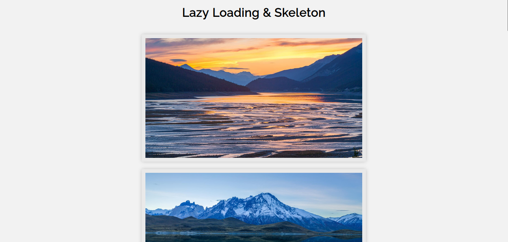

# Lazy loading & Skeleton

La pagina usa el efecto de renderizado condicional en base a lazy loading nativo del navegador, por lo que es muy probale que con versiones muy recientes de algunos navegadores no cuente con soporte.

Tambien se muestra una animacion muy conocida como skeleton realizada con css puro y algunos keyframe para lograr este efecto tan agradable a la vista.

## Carga
Al momento de cargar la pagina las imagenes se mostraran con el efecto skeleton.

## Finalizado
Cuando se terminan de cargar las imagenes desaparece el efecto skeleton y estas seran visibles.

